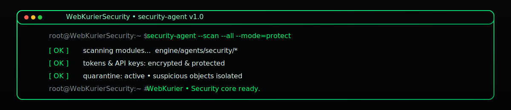

## Репозитории экосистемы WebKurier (10 слотов)

<p align="center">
  
</p>

<p align="center">
  <a href="https://github.com/Vladislav6410/WebKurierSecurity/actions/workflows/security-scan.yml">
    
  </a>
  <a href="https://github.com/Vladislav6410/WebKurierSecurity/actions/workflows/node-tests.yml">
    
  </a>
  <a href="https://github.com/Vladislav6410/WebKurierSecurity/actions/workflows/deploy-docs.yml">
    
  </a>
  <a href="https://github.com/Vladislav6410/WebKurierSecurity/blob/main/LICENSE.txt">
    
  </a>
  
</p>

---

# WebKurierSecurity — Threat Detection, Anti-Phishing & System Integrity Guard

**WebKurierSecurity** is the dedicated security domain hub of the WebKurier ecosystem.  
It provides multi-layer protection across all repositories, services, bots, files, cloud storage, and user interactions.

Its mission:
- Prevent system compromise  
- Detect malicious files, scripts, and payloads  
- Validate incoming data (bots, uploads, external APIs)  
- Protect user credentials & flows  
- Monitor suspicious activity in real time  
- Quarantine threats across the entire platform  

Security is integrated with Core, PhoneCore, VehicleHub, Chain, Hybrid, and all bot/mobile channels.

---

# 1. Role in the Ecosystem (Hierarchy Level 2)

```text
Level 0 — WebKurierHybrid (orchestrator)
Level 1 — WebKurierCore (gateway)
Level 2 — WebKurierSecurity (THIS REPOSITORY)
Level 2 — WebKurierVehicleHub
Level 2 — WebKurierPhoneCore
Level 2 — WebKurierChain
Level 3 — iOS/Android mobile clients
Level 4 — Public site
Level 5 — Future/X Labs

Security operates horizontally across all layers.

Routing examples:

File upload scan

Core → Security.scan → Core → User

Bot message safety

PhoneCore.bot → Security.phishing_check → PhoneCore

Mission file validation

VehicleHub → Security.dataset_check → VehicleHub

Suspicious blockchain event

Chain → Security.audit → Chain


⸻

2. Repository Structure (High-Level)

WebKurierSecurity/
├── engine/
│   ├── scanners/
│   │   ├── file_scanner.py
│   │   ├── script_scanner.py
│   │   ├── archive_scanner.py
│   │   └── dataset_scanner.py
│   ├── phishing/
│   │   ├── phishing_detector.py
│   │   ├── message_patterns.json
│   │   └── url_reputation.py
│   ├── antivirus/
│   │   ├── signature_db.json
│   │   ├── behavior_engine.py
│   │   └── quarantine_manager.py
│   ├── auth_guard/
│   │   ├── flow_validator.py
│   │   ├── rate_limiter.py
│   │   └── brute_force_detector.py
│   ├── audit/
│   │   ├── security_log.py
│   │   ├── anomaly_detector.py
│   │   └── chain_alerts.py
│   ├── compliance/
│   │   ├── policy_rules.json
│   │   ├── policy_enforcer.py
│   │   └── incident_protocols.md
│   ├── api/
│   │   ├── security_rest.py
│   │   ├── security_ws.py
│   │   └── hooks/
│   └── utils/
│       ├── crypto_tools.py
│       ├── sandbox_runner.py
│       └── checksum.py
├── config/
│   ├── security_profiles.json
│   ├── threat_levels.json
│   └── quarantine_settings.json
├── quarantine/
│   └── (isolated malicious files during runtime)
├── tools/
│   ├── cli.py
│   ├── log_inspector.py
│   └── signature_updater.py
└── docs/
    ├── SECURITY_MODEL.md
    ├── API.md
    └── INCIDENT_RESPONSE.md


⸻

3. Core Responsibilities

3.1. File & Payload Scanning
	•	Malware detection (signature-based & heuristic)
	•	Script scanning (JS, Python, batch)
	•	ZIP/TAR/RAR archive scanning
	•	Dataset validation for:
	•	geodesy data
	•	mission files
	•	image/video datasets
	•	Quarantine management

3.2. Anti-Phishing Engine
	•	Pattern detection in text messages
	•	Suspicious URL reputation checks
	•	Bot conversation safety
	•	Fraudulent intent detection

3.3. Antivirus Behavior Engine
	•	Runtime behavior scoring
	•	System-wide threat monitoring
	•	Cross-repository alerts
	•	Automated isolation of dangerous artifacts

3.4. Authentication & Flow Protection
	•	Rate limiting
	•	Brute-force attack detection
	•	Suspicious flow blocking
	•	Integration with Chain for secure token checks

3.5. Anomaly & Audit Systems
	•	Security logs consolidation
	•	Anomaly detection for:
	•	unusual API calls
	•	high-risk geodesy uploads
	•	wallet transactions
	•	mission modifications
	•	Alerts propagated to Chain

3.6. Policy & Compliance
	•	Organization-wide rules for secure operation
	•	Role-based restrictions
	•	Incident response protocols
	•	Secure bootstrap for new agents/services

⸻

4. Cross-Repository Interaction

With WebKurierCore
	•	Terminal command validation
	•	SecondSelf prompt filtering
	•	Portal file safety checks

With WebKurierPhoneCore
	•	Bot message sanitization
	•	Attachment analysis
	•	Anti-phishing in chat

With WebKurierVehicleHub
	•	Mission file validation
	•	Dataset checks before 3D reconstruction
	•	Protection against malicious EXIF/metadata

With WebKurierChain
	•	Audit trail linking
	•	Suspicious transaction detection
	•	Alert propagation to blockchain

With WebKurierHybrid
	•	Central CI/CD security scans
	•	Secret policy enforcement

⸻

5. CI/CD Policy

Security builds include:
	•	Python engines
	•	Signature DB updates
	•	Behavior engine tests
	•	Integration scanning for VehicleHub/PhoneCore/Core payloads

Secrets are controlled at Hybrid level.
Quarantine folder excluded from version control.

⸻

6. Agent Glossary (EN + RU translations only)

SecurityAgent — Агент безопасности
FileScanner — Сканер файлов
ScriptScanner — Сканер скриптов
DatasetScanner — Сканер датасетов

PhishingAgent — Агент антифишинга
URLReputation — Репутация URL

AntivirusAgent — Антивирусный агент
BehaviorEngine — Поведенческий движок

AuthGuard — Страж аутентификации
BruteForceDetector — Детектор брутфорса
RateLimiter — Ограничитель частоты запросов

AuditAgent — Агент аудита
AnomalyDetector — Детектор аномалий

PolicyAgent — Агент политик
ComplianceAgent — Агент нормативов
QuarantineManager — Менеджер карантина


⸻

7. Governance

WebKurierSecurity is maintained under
Vladyslav Hushchyn (VladoExport)
Germany, EU.

⸻


